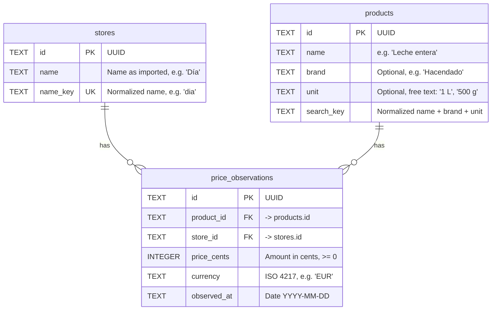

# Data model

cartrac stores supermarket purchase prices over time in a **SQLite** database
(`data/cartrac.db`, relative to the project root; configurable with `--db`).

The model revolves around one idea: a **price observation** is the price a **product** had in a
**store** on a given **date**. With many observations you can follow how a product's price
evolves and compare it across supermarkets.

## Entity-relationship diagram

## Tables

### `stores`

Supermarkets or shops where prices are observed.

| Column     | Type | Constraints      | Description                                             |
|------------|------|------------------|---------------------------------------------------------|
| `id`       | TEXT | PK               | UUID generated by the application.                      |
| `name`     | TEXT | NOT NULL         | Display name.                                           |
| `name_key` | TEXT | NOT NULL, UNIQUE | Normalized name (lowercase, no accents or punctuation). |

`name_key` guarantees that `"Día"`, `"DIA"` and `"dia"` are the same store.

### `products`

Items being bought.

| Column       | Type | Constraints | Description                                         |
|--------------|------|-------------|-----------------------------------------------------|
| `id`         | TEXT | PK          | UUID generated by the application.                  |
| `name`       | TEXT | NOT NULL    | Product name.                                       |
| `brand`      | TEXT | —           | Brand (optional).                                   |
| `unit`       | TEXT | —           | Unit or package format as free text (optional).     |
| `search_key` | TEXT | NOT NULL    | Normalized `name + brand + unit`; used by searches. |

Searches require **every** word of the query to appear in `search_key`
(one `search_key LIKE '%word%'` per word), so they are case and accent insensitive.

### `price_observations`

Facts: the price of a product in a store on a date.

| Column        | Type    | Constraints                  | Description                                |
|---------------|---------|------------------------------|--------------------------------------------|
| `id`          | TEXT    | PK                           | UUID generated by the application.         |
| `product_id`  | TEXT    | NOT NULL, FK → `products.id` | Observed product.                          |
| `store_id`    | TEXT    | NOT NULL, FK → `stores.id`   | Store where it was observed.               |
| `price_cents` | INTEGER | NOT NULL, CHECK `>= 0`       | Amount in cents (`1.25 €` → `125`).        |
| `currency`    | TEXT    | NOT NULL                     | ISO 4217 currency code (`EUR` by default). |
| `observed_at` | TEXT    | NOT NULL                     | ISO date `YYYY-MM-DD`.                     |

#### Indexes

| Index                            | Columns                        | Purpose                                   |
|----------------------------------|--------------------------------|-------------------------------------------|
| `idx_price_observations_product` | `product_id, observed_at DESC` | Price history of a product, newest first. |
| `idx_price_observations_store`   | `store_id`                     | Queries by store.                         |

## Relationships

- A **store** has zero or many observations; each observation belongs to one store.
- A **product** has zero or many observations; each observation belongs to one product.
- `products` and `stores` are related **many-to-many** through `price_observations`.

Foreign keys are enforced (`PRAGMA foreign_keys = ON`).

## Design decisions

- **Amounts in cents (`INTEGER`)**: avoids floating point rounding errors.
- **Dates as ISO text**: SQLite has no date type; the `YYYY-MM-DD` format sorts correctly as text.
- **Normalized keys (`name_key`, `search_key`)**: computed by the application with
  `ProductMatcher.normalize` (domain), so the database needs no extensions for
  accent-insensitive search.
- **UUID primary keys**: generated by the domain, independently of the database.
- **Product deduplication on import**: decided by `ProductMatcher` comparing the similarity of
  `name + brand + unit`; there is no UNIQUE constraint on `products` because matching is fuzzy.
- **WAL mode** (`PRAGMA journal_mode = WAL`): better concurrency between reads and writes.

## Migrations

The schema is created when the database is opened (`CREATE TABLE IF NOT EXISTS`), and then
idempotent migrations are applied in `src/adapters/persistence/sqlite/database.ts`:

| Migration                         | Reason                                 |
|-----------------------------------|----------------------------------------|
| `products.size` → `products.unit` | Field renamed in the `Product` entity. |

## Mapping to the domain

| Table                | Domain entity (`src/domain/`) | Notes                                       |
|----------------------|-------------------------------|---------------------------------------------|
| `stores`             | `Store`                       | `name_key` is a persistence detail.         |
| `products`           | `Product`                     | `search_key` is a persistence detail.       |
| `price_observations` | `PriceObservation`            | `price_cents` + `currency` → `Money` value. |

## Known limitations

- `unit` is free text: price per kg/litre cannot be computed, nor different formats compared.
- No categories, EAN codes or purchase receipts.
- Nothing prevents recording the same observation twice (same product, store, date and price).
